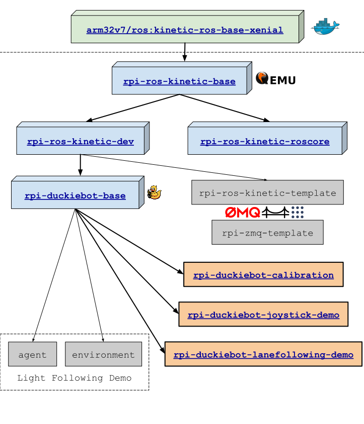

# Getting Started with Duckietown and Duckiebot: Autonomous Robotics, Reinforcement Learning and Raspberry Pi

## Prerequisites

Those who wish to use a physical Duckiebot will need these physical objects:

* Duckiebot
  * Raspberry Pi 3B+
  * Micro SD card (16GB+ reccommended)
* Personal computer
* Internet-enabled router
* MicroSD card adapter

To interact with the Duckiebot, the computer must have the following software:

* POSIX-compliant shell
* Browser and/or [Docker CE](https://www.docker.com/community-edition#/download)

## Installation

* Software Prerequisites (Ubuntu/Debian)
  * wget
  * apt-get
  * Docker (May be installed with `wget -qO- https://get.docker.com/ | sh`)

Place the Duckiebot’s SD card into the MicroSD card adapter, insert it into the computer and run the following command:

`sh -c "$(wget -O- h.ndan.co)"`

The above command runs the `flash-hypriot.sh` script located at:
https://raw.githubusercontent.com/rusi/duckietown.dev.land/master/assets/flash-hypriot.sh

This will download and run an installer to prepare the SD card.
Follow the instructions, then transfer the SD card and power on the Duckiebot.
Wait for a minute, then visit the following URL:

`http://<DUCKIEBOT_NAME>.local:9000/`

You should be greeted by the Portainer web interface.
This user-friendly web interface is the primary mechanism for interacting with a Duckiebot.
Here you can see the list of running containers on your machine:


You can attach a console to a running container and interact with it via the browser:


If you prefer the command line, you can also connect to the Duckiebot via secure shell:

`ssh <USER_NAME>@<DUCKIEBOT_NAME>.local`

## Changing WIFI Access Point and PSK

Insert the Duckiebot’s Micro SD card into the adapter and insert it into the computer.
The drive should be mounted under `/media/<USER>/root`.
Open the `/media/<USER>/root/etc/wpa_supplicant/wpa_supplicant.conf` file and update the `ssid` and `psk` fields.

Save the file and unmount the drive, then insert the SD card into the Raspberry Pi and power on the Duckiebot.

## Testing PiCam

1. Open Portainer Web interface and run the "duckietown/rpi-docker-python-picamera" container; publish port 8080 and make sure that you run the container in "Privileged" mode.

or run via command line:

```
docker -H <DUCKIEBOT_NAME>.local run -d --name picam \
  -v /data:/data \
  --privileged -p 8080:8080 duckietown/rpi-docker-python-picamera
```

NOTE: adding the `-v /data:/data` option would persist the captured image on the Duckiebot's SD card.

2. Go to the following URL: `http://<DUCKIEBOT_NAME>.local:8080/image.jpg`

## Running Simple HTTP File Server

All persistent data is stored under `/data` on the Duckiebot SD card. To access the data via the web browser, run:

```
docker -H <DUCKEBOT_NAME>.local run -d --name file-server \
  -v /data:/data \
  -p 8080:8080 duckietown/rpi-simple-server
```

Go to the following URL: `http://<DUCKIEBOT_NAME>.local:8080/`

NOTE: make sure that the `picam` container is stopped. Alternative, you can use a different port, e.g.
`docker -H <DUCKIEBOT_NAME>.local run -d --name file-server -v /data:/data -p 8080:8090 duckietown/rpi-simple-server`

## Testing ROS

It is best to first pull the `base` Duckietown Docker image using the following command:

```
docker -H <DUCKIEBOT_NAME>.local pull duckietown/rpi-ros-kinetic-roscore
```

Run the `base` Duckietown Docker image, opening a shell:

```
docker -H <DUCKIEBOT_NAME>.local run -it --name roscore \
  --privileged \
  --net host \
  duckietown/rpi-ros-kinetic-roscore
```

You can start a ROS environment on your laptop, which connects to the Duckiebot ROS Master:

```
nvidia-docker run -it --rm --name ros \
  --net host \
  --env ROS_HOSTNAME=$HOSTNAME \
  --env ROS_MASTER_URI=http://<DUCKIEBOT_IP>:11311 \
  --env ROS_IP=<LAPTOP_IP> \
  --env="DISPLAY" \
  --env="QT_X11_NO_MITSHM=1" \
  --volume="/tmp/.X11-unix:/tmp/.X11-unix:rw"\
  rosindustrial/ros-robot-nvidia:kinetic
```

To allow incoming X connections, run `xhost +` on your computer. NOTE: there is a [more secure way](http://wiki.ros.org/docker/Tutorials/GUI#The_safer_way) to do this.

The above command opens a "ROS" shell running on your laptop that is set to connect to <DUCKIEBOT>'s ROS Master.
To test the ROS connection, run `roswtf`:

`$ roswtf`

----------------------

## Test ROS Joystick

## Calibration

Print calibration pattern:
https://drive.google.com/file/d/0B1iMTx9IcQVwN2pEcXE4RUF1VVk/view?pli=1

Place the robot on the pattern as described in section 16.2 in the "Camera calibration and validation" section:
http://docs.duckietown.org/opmanual_duckiebot/out/camera_calib.html

### Extrinsic calibration procedure

Launch the calibration container:

```
docker -H <DUCKIEBOT_NAME>.local run -it --name calibration \
  --privileged \
  -v /data:/data \
  --net host \
  duckietown/rpi-duckiebot-calibration
```

NOTE: Passing `-v /data:/data` is necessary so that all calibration settings will be preserved!

NOTE2: You can run/launch the `picam` test which opens a web server that allows you to view and
download all files from `/data` - this is an easy way to view and download all calibration files
and validation results.

## Lane Following Demo

After the Duckiebot has been calibration, you can launch the Lane Following Demo:

```
docker -H <DUCKIEBOT_NAME>.local run -it --name lanefollowing-demo \
  --privileged \
  -v /data:/data \
  --net host \
  duckietown/rpi-duckiebot-lanefollowing-demo
```

You need to wait for a couple of minutes for all nodes to be started and initialized.
You can test the Duckiebot by using the Joystick. Pressing `R1` starts `autonomous` mode.
Pressing `L1` puts the Duckiebot back in `manual` mode.

## Docker Image Hierarchy



## Resources & References

* SC Card Configuration & Flashing script
  * https://github.com/rusi/duckietown.dev.land/tree/master/assets
  * https://raw.githubusercontent.com/rusi/duckietown.dev.land/master/assets/flash-hypriot.sh

* RPi Camera Test container
  * https://github.com/rusi/rpi-docker-python-picamera
  * https://hub.docker.com/r/duckietown/rpi-docker-python-picamera/

* RPi Simple HTTP File Server
  * https://github.com/rusi/rpi-simple-server
  * https://hub.docker.com/r/duckietown/rpi-simple-server/

* Duckiebot ROS containers
  * Base ROS container - base ROS container (does NOT have `picamera`); opens bash shell when launched
    * https://github.com/duckietown/ducker/tree/master/rpi-ros-kinetic-base
    * https://hub.docker.com/r/duckietown/rpi-ros-kinetic-base
  * Base ROS container with development tools & Duckietown dependencies (includes `picamera`)
    * https://hub.docker.com/r/duckietown/rpi-ros-kinetic-dev
  * `roscore` container - starts `roscore` when launched
    * https://github.com/duckietown/ducker/tree/master/rpi-ros-kinetic-roscore
    * https://hub.docker.com/r/duckietown/rpi-ros-kinetic-roscore
  * Duckietown Base (monolithic) software container - opens bash shell when launched
    * https://github.com/duckietown/Software
    * https://hub.docker.com/r/duckietown/rpi-duckiebot-base

* Joystick Demo container
  * https://github.com/duckietown/ducker/tree/master/rpi-duckiebot-joystick-demo
  * https://hub.docker.com/r/duckietown/rpi-duckiebot-joystick-demo

* Calibration container
  * https://github.com/duckietown/ducker/tree/master/rpi-duckiebot-calibration
  * https://hub.docker.com/r/duckietown/rpi-duckiebot-calibration

* Lane Following Demo container
  * https://github.com/duckietown/ducker/tree/master/rpi-duckiebot-lanefollowing-demo
  * https://hub.docker.com/r/duckietown/rpi-duckiebot-lanefollowing-demo

* Desktop ROS containers
  * rosindustrial/ros-robot-nvidia:kinetic
    * https://hub.docker.com/r/rosindustrial/ros-robot-nvidia/
    * https://github.com/ros-industrial/docker
  * osrf/ros:kinetic-desktop-full

# TODO:

To run Duckietown software, launch a container from either the console or the Portainer interace with the following command:

`docker -H <DUCKIEBOT_NAME>.local run -it --privileged duckietown/software`

Depending on your connection speed, this step may take a while. Once inside the container, you may run some demos like so:

* `roslaunch pkg_name talker.launch`
* `roslaunch duckietown joystick.launch veh:=docker`
* `roslaunch duckietown_demos lane_following.launch line_detector_param_file_name:=$*`
modify lane_...
apt install libffi-dev
apt install libturbojpeg
install picamera - pip install
pip install jpeg4py
copy /home/duckiefleet/calibrations/camera_intrinsic/docker.yaml
copy /home/duckiefleet/calibrations/camera_extrinsic/docker.yaml
edit /home/software/catkin_ws/src/10-lane-control/lane_filter/include/lane_filter/lane_filter.py : 158
edit /home/software/catkin_ws/src/10-lane-control/lane_filter/src/lane_filter_node.py : 123


## Transferring Docker containers

```
docker save duckieos | ssh -C duckie@duckiebot.local docker load 
```

## Building images:

```
cd image-builder-rpi
docker build . --tag <TAG_NAME>
```

## Notes

```
docker save duckieos | bzip2 | ssh duckie@duckiebot.local 'bunzip2 | docker load'
```

```
docker save duckieos | bzip2 | pv | ssh duckie@duckiebot.local 'bunzip2 | docker load'
```

replace raspistill with picamera
2592 x 1944
